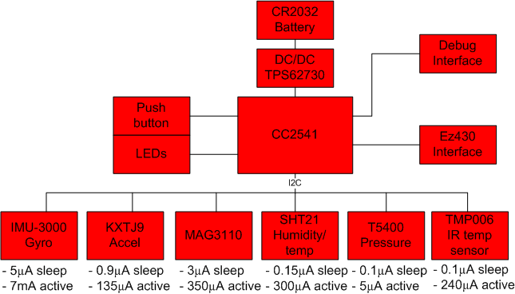

# Working with SensorTags

A small sample using the SensorTag from Texas Instruments in conjunction with the Raspberry Pi 3.


## Overview

In this sample we will work with a SensorTag and a Rasperry Pi 3. The target is to understand the interaction between the SensorTag and the Raspbery Pi 3 via Bluetooth Low Energy (BTLE). The Raspberry Pi 3 was chosen as it comes with an on-board Bluetooth chip.

## Requirements

In order to fully cover this tutorial we need the following setup:

* A Raspberry Pi 3
* A TI SensorTag
* WiFi or Ethernet connection to the Rapsberry Pi
* A proper OS on the Raspberry Pi 3 (incl. a C compiler and Bluetooth)
* A connection via SSH to the Raspberry Pi

We can use an editor installed on the Raspberry Pi 3, e.g., nano, ed, or vim. The tutorial uses the *Raspbian Jessie* image on the Raspberry Pi 3. This one should come with the Bluetooth drivers, otherwise try executing the following command:

```bash
sudo apt-get install pi-bluetooth
```

## Step-By-Step

We start by setting up the hardware environment. The software should be all pre-configured, especially if we choose to take one of the available images.

### Playing with Bluetooth from the Command Line

Connect to the Raspberry Pi with your favorite SSH client (e.g., Putty from Windows). In the shell you can now play around using the following instructions:

1. Run the standard Bluetooth program (should come with the OS) by typing `bluetoothctl`.
2. Turn on the Bluetooth, if not already on, by typing `power on`. Similarly, the power can be turned off with `power off`.
3. Use the `devices` command to list the paired devices.
4. Enter the device discovery mode with the `scan on` command. After some time the SensorTag should appear (let's say with the MAC address 34:B1:F7:D4:F2:CF).
5. Enter `pair 34:B1:F7:D4:F2:CF` to create the pairing between the Pi and the SensorTag.
6. Now we can stop discovering devices with `scan off`.
7. Exit the program by typing `exit`.

This way we discovered and paired our device. Now we can use the `gatttool` to play around with values.

1. Run the program by typing `gatttool -b 34:B1:F7:D4:F2:CF --interactive`. We enter an interactive session.
2. The first command we issue is `connect`. We should see a "Connection successful" message.
3. Now we can try to read from the SensorTag: `char-read-hnd 0x25` uses the handle 0x25 to read data from the thermometer. We should see some zeros.
4. To read some values we need to turn on the thermometer. We issue `char-write-cmd 0x29 01` to turn the thermometer sensor at 0x29 on.
5. Issuing the command `char-read-hnd 0x25` again should now yield a non-zero value.
6. Exit the program by typing `exit`.

### Handles

The SensorTag comes with a lot of different sensors. This includes:

* Contactless IR temperature sensor (Texas Instruments TMP006)
* Humidity Sensor (Sensirion SHT21)
* Gyroscope (Invensense IMU-3000)
* Accelerometer (Kionix KXTJ9)
* Magnetometer (Freescale MAG3110)
* Barometric pressure sensor (Epcos T5400)
* On-chip temperature sensor (Built into the CC2541)
* Battery/voltage sensor (Built into the CC2541)

Turning the different sensors on or off has an impact on the power consumption. The following image illustrates the different power requirements.



The following table gives a short overview on some of the previously mentioned sensors.

| Sensor              | Read | Length  | Conf | Data |
| ------------------- | ---- | ------- | ---- | ---- |
| IR Temperature      | 0x25 | 4 bytes | 0x29 | 0x26 |
| Accelerometer       | 0x2d | 3 bytes | 0x31 | 0x2e |
| Humidity            | 0x38 | 4 bytes | 0x3c | 0x39 |
| Magnetometer        | 0x40 | 6 bytes | 0x44 | 0x41 |
| Barometric Pressure | 0x4b | 4 bytes | 0x4f | 0x4c |
| Gyroscope           | 0x57 | 6 bytes | 0x5b | 0x58 |

The barometric pressure sensor also requires an extra calibration. The calibration has to be done before the first measurement. The following steps are required:

1. We issue the command `char-write-cmd 0x4f 02`. This performs the calibration.
2. The device is now read via `char-read-hnd 0x52` yielding the raw value.

Overall, the following image shows a nice map of the sensor components placed over the SensorTag board.


### Bluetooth with C

(tbd)

## Conclusions

(tbd)

## References

* [Raspbian Image Download](https://www.raspberrypi.org/downloads/raspbian/)
* [Raspberry Pi and TI CC2541 SensorTag](http://mike.saunby.net/2013/04/raspberry-pi-and-ti-cc2541-sensortag.html)
* [Raspberry Pi 3 - How to Configure Wi-Fi and Bluetooth](https://www.maker.io/en/blogs/raspberry-pi-3-how-to-configure-wi-fi-and-bluetooth/03fcd2a252914350938d8c5471cf3b63)
* [SensorTag User Guide](http://processors.wiki.ti.com/index.php/SensorTag_User_Guide)
* [Bluetooth Programming](https://people.csail.mit.edu/albert/bluez-intro/c404.html)